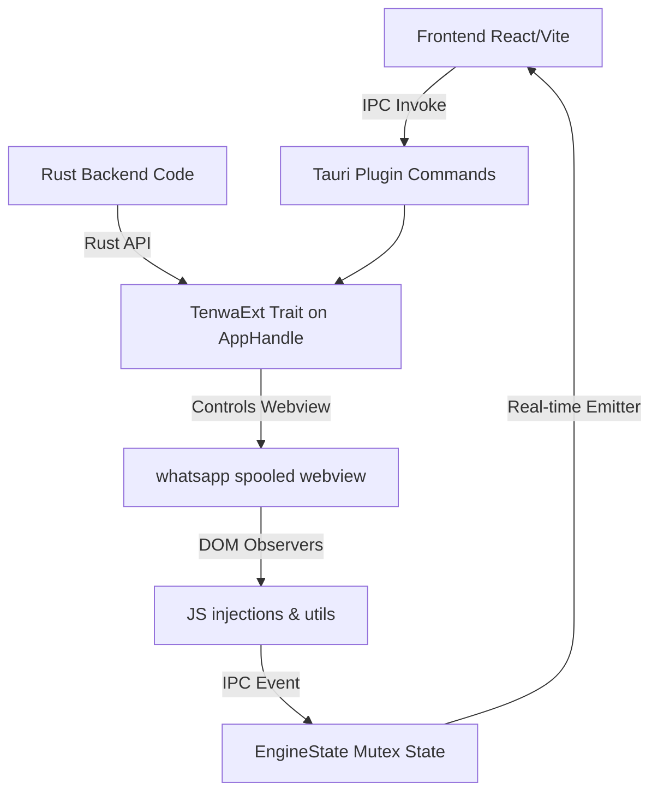

# tauri-plugin-tenwa

A professional, modular, headless WhatsApp Web integration plugin for Tauri v2. It spools a background webview loading WhatsApp Web, tracks authorization and QR code states in real-time, and exposes a high-level API to send text/media messages from both your Frontend (via IPC) and your Backend (via Rust extension traits).

---

## Architecture Overview



The plugin operates by spawning a background Tauri Webview window named `"whatsapp"`. Custom scripts are injected to:
1. Expose WhatsApp Web's internal ES modules (`injections::EXPOSE_AUTH_STORE`).
2. Attach sending utilities (`injections::LOAD_UTILS`).
3. Monitor page state and QR code canvas renders (`QR_OBSERVER`), which feed updates back to the Rust backend and emit real-time updates to the frontend.

---

## Installation & Setup

### 1. Register the Dependency
Add the dependency to your `src-tauri/Cargo.toml` file.

```toml
[dependencies]
# Remote Git Dependency:
tauri-plugin-tenwa = { git = "https://github.com/tentaclespvtltd/tenWA.git", version = "0.1.0" }

# Or Local Path Dependency (for development):
# tauri-plugin-tenwa = { path = "../tenWA" }
```

### 2. Register the Plugin in Rust
In your main application entry point (e.g. `src-tauri/src/lib.rs` or `main.rs`), initialize and register the plugin:

```rust
pub fn run() {
    tauri::Builder::default()
        // Register the tenwa plugin
        .plugin(tauri_plugin_tenwa::init())
        .run(tauri::generate_context!())
        .expect("error while running tauri application");
}
```

### 3. Configure Permissions
To allow frontend calls to the plugin commands, configure the permissions in your capabilities file (e.g. `src-tauri/capabilities/default.json`):

```json
{
  "permissions": [
    "core:default",
    "tenwa:default"
  ]
}
```

---

## Function Reference: Frontend Integration (Guest JS)

The plugin includes a dedicated guest library **`guest-js/index.ts`** that exposes clean helper functions for your frontend application (React, Vue, Svelte, etc.).

### `openWhatsApp`
- **Working**: Spawns the background WhatsApp Web spooled browser engine by invoking the Rust backend.
- **Input**: `visible?: boolean` - Optional flag to show the browser window (default: `false`).
- **Output**: `Promise<void>` - Resolves when the engine is successfully instructed to start.

### `getWhatsAppStatus`
- **Working**: Fetches the current connection and initialization status of the engine from the Rust state.
- **Input**: None.
- **Output**: `Promise<WhatsAppStatus>` - Resolves with an object containing:
  - `status`: String (`'Offline'`, `'QR'`, `'CONNECTED'`, `'authenticated'`, etc.)
  - `payload`: String (QR code base64 reference string when status is "QR", otherwise empty)
  - `started`: Boolean (True if background webview has spooled)

### `saveConfigVal`
- **Working**: Saves a key-value configuration pair to the local `config.json` file.
- **Input**: 
  - `key: string` - The configuration key.
  - `value: string` - The configuration value.
- **Output**: `Promise<void>` - Resolves when the configuration is saved.

### `sendWhatsAppMessage`
- **Working**: Sends a plain text message to a specific phone number by evaluating JavaScript in the WhatsApp webview. Automatically strips non-numeric characters from the phone number.
- **Input**:
  - `phone: string` - Recipient phone number with country code (e.g. `"919876543210"`).
  - `message: string` - Message content.
- **Output**: `Promise<void>` - Resolves if the message was sent successfully.

### `sendWhatsAppMedia`
- **Working**: Sends a media message (image, video, document) with an optional caption.
- **Input**:
  - `phone: string` - Recipient phone number.
  - `message: string` - Caption message.
  - `mediaBase64: string` - Raw base64 data (without "data:...base64," prefix).
  - `mimeType: string` - Mimetype (e.g., `"image/png"`, `"application/pdf"`).
  - `fileName: string` - Target filename.
- **Output**: `Promise<void>`

### `logoutWhatsApp`
- **Working**: Logs out of the current session, unlinks the device, and closes the spooled webview window.
- **Input**: None.
- **Output**: `Promise<void>`

### `onWhatsAppStatusChange`
- **Working**: Sets up an IPC listener for real-time authentication and status updates emitted by the plugin.
- **Input**: 
  - `callback: (status: string, payload: string) => void` - Function to be called whenever a status event is received.
- **Output**: `Promise<() => void>` - Resolves with an unlisten cleanup function to remove the listener.

### `onWhatsAppQRChange`
- **Working**: Sets up an IPC listener specifically tuned to capture WhatsApp Web QR code string updates.
- **Input**:
  - `callback: (qrCode: string) => void` - Function to be called with the raw QR code string.
- **Output**: `Promise<() => void>` - Resolves with an unlisten cleanup function.

---

## Function Reference: Backend API (Rust `TenwaExt`)

The plugin exposes the `TenwaExt` trait on `tauri::AppHandle`, allowing you to call these functions directly from your Rust backend anywhere `AppHandle` is accessible.

### `tenwa_open`
- **Working**: Spawns the WhatsApp webview window. Spoofs the user agent and injects observers.
- **Input**: `visible: Option<bool>` - Show window if `Some(true)`, run headlessly if `Some(false)`.
- **Output**: `Result<(), String>`

### `tenwa_auth_status_update`
- **Working**: Internally updates the `EngineState` mutex and emits the `"auth_status"` event to the frontend.
- **Input**: 
  - `status: String`
  - `payload: String`
- **Output**: `Result<(), String>`

### `tenwa_get_status`
- **Working**: Retrieves current engine status from the internal state mutex.
- **Input**: None.
- **Output**: `Result<serde_json::Value, String>` - Returns a JSON object with `status`, `payload`, and `started`.

### `tenwa_save_config_val`
- **Working**: Persists a configuration value to disk.
- **Input**:
  - `key: String`
  - `value: String`
- **Output**: `Result<(), String>`

### `tenwa_send_message`
- **Working**: Evaluates `WWebJS.sendMessage` in the webview to send a text message.
- **Input**:
  - `phone: String`
  - `message: String`
- **Output**: `Result<(), String>`

### `tenwa_send_media`
- **Working**: Evaluates `WWebJS.sendMessage` in the webview to send media.
- **Input**:
  - `phone: String`
  - `message: String`
  - `media_base64: String`
  - `mime_type: String`
  - `file_name: String`
- **Output**: `Result<(), String>`

### `tenwa_logout`
- **Working**: Executes multiple programmatic logout strategies in the webview to ensure the session is unlinked, then terminates the webview.
- **Input**: None.
- **Output**: `Result<(), String>`
