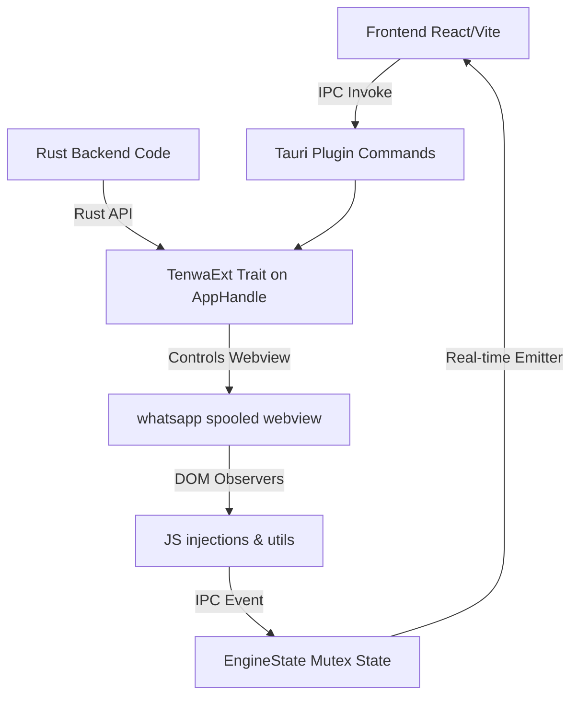

# tauri-plugin-tenwa

A professional, modular, headless WhatsApp Web integration plugin for Tauri v2. It spools a background webview loading WhatsApp Web, tracks authorization and QR code states in real-time, and exposes a high-level API to send text/media messages from both your Frontend (via IPC) and your Backend (via Rust extension traits).

---

## Architecture Overview



The plugin operates by spawning a background Tauri Webview window named `"whatsapp"`. Custom scripts are injected to:
1. Expose WhatsApp Web's internal ES modules (`injections::EXPOSE_AUTH_STORE`).
2. Attach sending utilities (`injections::LOAD_UTILS`).
3. Monitor page state and QR code canvas renders (`QR_OBSERVER`), which feed updates back to the Rust backend and emit real-time updates to the frontend.

---

## Installation & Setup

### 1. Register the Dependency
Add the dependency to your `src-tauri/Cargo.toml` file.

```toml
[dependencies]
# Remote Git Dependency:
tauri-plugin-tenwa = { git = "https://github.com/tentaclespvtltd/tenWA.git", version = "0.1.0" }

# Or Local Path Dependency (for development):
# tauri-plugin-tenwa = { path = "../tenWA" }
```

### 2. Register the Plugin in Rust
In your main application entry point (e.g. `src-tauri/src/lib.rs` or `main.rs`), initialize and register the plugin:

```rust
pub fn run() {
    tauri::Builder::default()
        // Register the tenwa plugin
        .plugin(tauri_plugin_tenwa::init())
        .run(tauri::generate_context!())
        .expect("error while running tauri application");
}
```

### 3. Configure Permissions
To allow frontend calls to the plugin commands, configure the permissions in your capabilities file (e.g. `src-tauri/capabilities/default.json`):

```json
{
  "permissions": [
    "core:default",
    "tenwa:allow-open-whatsapp",
    "tenwa:allow-auth-status-update",
    "tenwa:allow-send-message",
    "tenwa:allow-send-message-with-media",
    "tenwa:allow-logout-whatsapp",
    "tenwa:allow-get-engine-status",
    "tenwa:allow-save-config-val"
  ]
}
```

---

## Rust Backend API

The plugin exposes the `TenwaExt` trait on `tauri::AppHandle`. This allows you to call commands programmatically from anywhere in your backend Rust code.

### Exposing the Extension Trait

```rust
use tauri::{AppHandle, Runtime};
use tauri_plugin_tenwa::TenwaExt;

fn my_rust_function<R: Runtime>(app: &AppHandle<R>) {
    // 1. Open the engine
    let _ = app.tenwa_open(Some(false)); // Headless launch

    // 2. Query status
    if let Ok(status) = app.tenwa_get_status() {
        println!("WhatsApp Engine status: {}", status);
    }

    // 3. Send a message
    let _ = app.tenwa_send_message("919876543210".to_string(), "Hello from Rust backend!".to_string());
}
```

### Extension API Reference

```rust
pub trait TenwaExt<R: Runtime> {
    /// Spawns the WhatsApp webview window.
    /// If visible is true, the window will show; if false, it runs headlessly.
    /// If window already exists, it un-hides and focuses the window.
    fn tenwa_open(&self, visible: Option<bool>) -> Result<(), String>;

    /// Updates internal status and emits real-time events.
    fn tenwa_auth_status_update(&self, status: String, payload: String) -> Result<(), String>;

    /// Retrieves current engine status as a serde_json::Value:
    /// { "status": String, "payload": String, "started": bool }
    fn tenwa_get_status(&self) -> Result<serde_json::Value, String>;

    /// Saves a key-value configuration pair to local config.json.
    fn tenwa_save_config_val(&self, key: String, value: String) -> Result<(), String>;

    /// Sends a text message to the specified phone number (automatically appends @c.us).
    fn tenwa_send_message(&self, phone: String, message: String) -> Result<(), String>;

    /// Sends a base64 encoded media message (image/video/document) with optional caption.
    fn tenwa_send_media(
        &self,
        phone: String,
        message: String,
        media_base64: String,
        mime_type: String,
        file_name: String,
    ) -> Result<(), String>;

    /// Programs log out from WhatsApp Web, unlinks session, and closes spooled webview window.
    fn tenwa_logout(&self) -> Result<(), String>;
}
```

---

## Frontend Integration Guide

The plugin includes a dedicated guest library **`guest-js/index.ts`** that exposes clean helper functions. This avoids writing raw `invoke` and `listen` commands in your frontend application.

### TypeScript Definitions

The guest-js library exposes the `WhatsAppStatus` structure:

```typescript
export interface WhatsAppStatus {
  status: 'Offline' | 'QR' | 'CONNECTED' | 'authenticated' | string;
  payload: string;   // QR code base64 reference string when status is "QR"
  started: boolean;  // True if background webview has spooled
}
```

### Exposing Guest API Helper Functions

You can import the functions directly into your React, Vue, Svelte, or TypeScript files:

```typescript
import { 
  openWhatsApp, 
  getWhatsAppStatus, 
  sendWhatsAppMessage, 
  sendWhatsAppMedia, 
  logoutWhatsApp,
  onWhatsAppStatusChange,
  onWhatsAppQRChange
} from 'tauri-plugin-tenwa/guest-js';

// 1. Start WhatsApp spooled browser engine (headless by default)
await openWhatsApp(false); 

// 2. Fetch current engine status
const currentStatus = await getWhatsAppStatus();
console.log(`State: ${currentStatus.status}, Started: ${currentStatus.started}`);

// 3. Send a text message (cleans formatting automatically)
await sendWhatsAppMessage("919876543210", "Hello from Frontend!");

// 4. Send media (e.g. base64 image or pdf)
await sendWhatsAppMedia(
  "919876543210",
  "Check this receipt!",
  "iVBORw0KGgoAAAANSUhEUgAAAAEAAAABCAQAAAC1HAwCAAAAC0lEQVR42mNkYAAAAAYAAjCB0C8AAAAASUVORK5CYII=",
  "image/png",
  "receipt.png"
);

// 5. Unlink session and logout
await logoutWhatsApp();

// 6. Listen to real-time status updates (returns unsubscribe function)
const unlisten = await onWhatsAppStatusChange((status, payload) => {
  console.log(`Realtime Auth Status: ${status}`);
});
// Cleanup when component unmounts:
unlisten();

// 7. Listen specifically to QR Code updates (returns unsubscribe function)
const unlistenQR = await onWhatsAppQRChange((qrCodeString) => {
  // Feed to your favorite QR code component or canvas generator
  console.log("QR Code Update:", qrCodeString);
});
// Cleanup:
unlistenQR();
```

